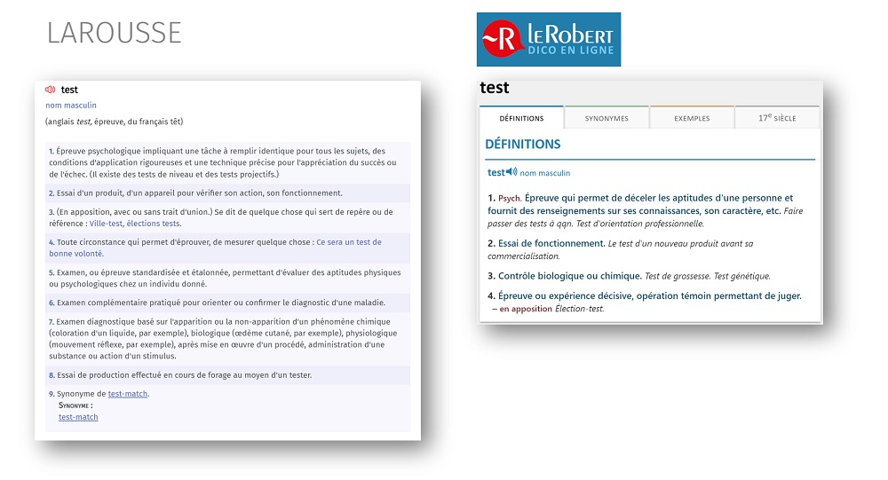
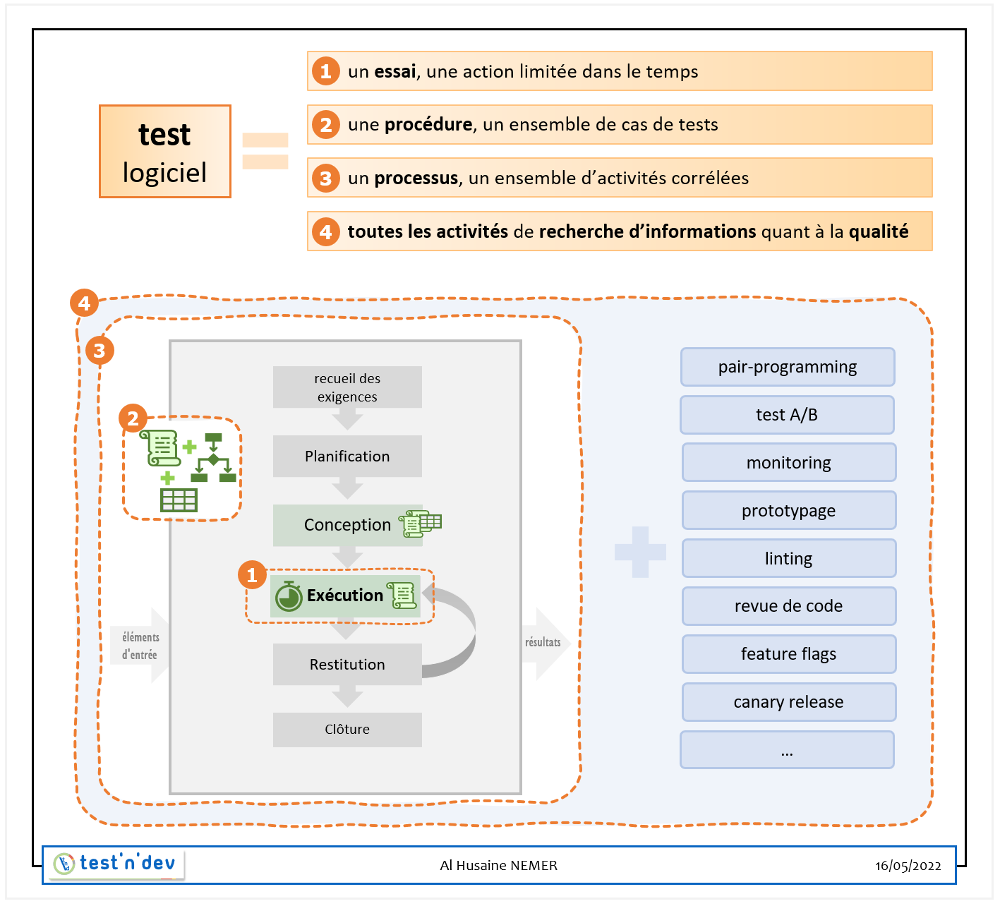
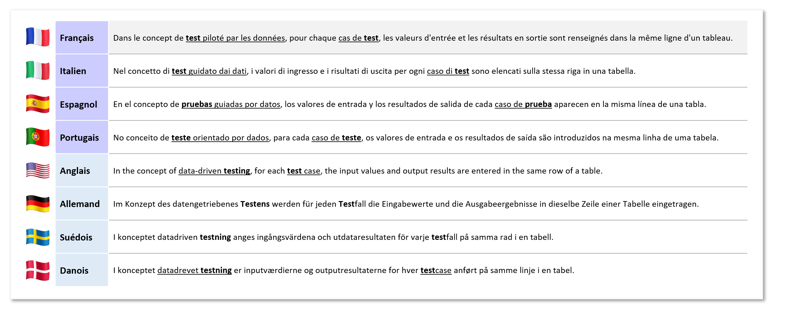
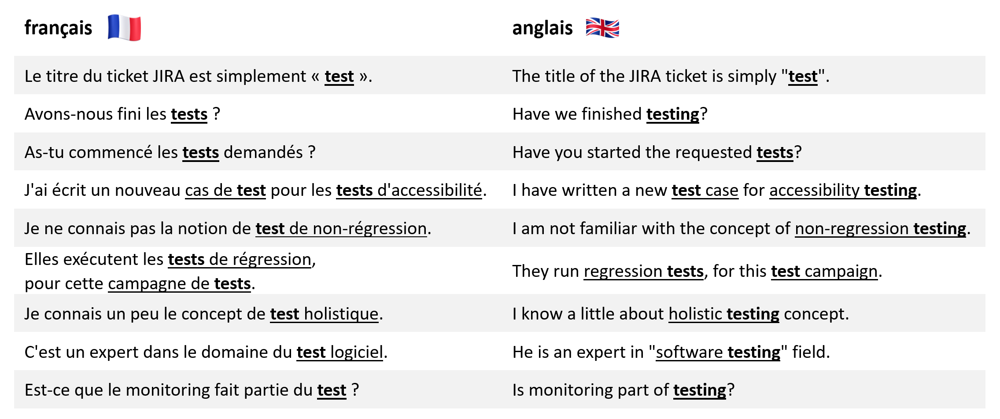

|                    | le « test » logiciel : 4 définitions                  |
| ------------------ | ----------------------------------------------------- |
| _Auteur_           | Alhusaine NEMER – [test'n'dev](https://testndev.com/) |
| _Date_             | 03/06/2022                                            |
| _Version / statut_ | 1.0.0                                                 |

----

_Table des matières_

- [Introduction](#introduction)
- [Pourquoi définir « test logiciel » ?](#pourquoi-définir--test-logiciel--)
- [Polysémie de « test logiciel »](#polysémie-de--test-logiciel-)
- [Que trouve-t-on dans le dictionnaire ?](#que-trouve-t-on-dans-le-dictionnaire-)
- [Que trouve-t-on sur Wikipédia ?](#que-trouve-t-on-sur-wikipédia-)
- [Définitions de « test logiciel » par CFTL/ISTQB](#définitions-de--test-logiciel--par-cftlistqb)
- [Synthèse des définitions trouvées](#synthèse-des-définitions-trouvées)
- [4 définitions en 4 niveaux](#4-définitions-en-4-niveaux)
- [Analogie avec le sondage d'opinion](#analogie-avec-le-sondage-dopinion)
- [Et par rapport à d'autres langues ?](#et-par-rapport-à-dautres-langues-)
- [Conclusion](#conclusion)

## Introduction

Définir un mot peut paraitre comme étant un exercice facile, et je vais m'y atteler aujourd'hui. Le mot que j'ai choisi est le suivant : «  **test**  », mais dans le domaine spécifique du logiciel. Et bien sûr, dans cet article, je vais m'occuper de sa définition en langue française. Vous comprendrez facilement pourquoi cet article ne sera pas traduit en l'état en anglais. J'omets sciemment l'article (défini ou indéfini) devant cette locution.

Cet article parlera particulièrement à mes collègues francophones qui interviennent de près ou de loin dans la cycle de vie de solutions logicielles (conception/développement/maintenance). Il intéressera aussi les profils de management, vente et support client de produits logiciels.

Attention, l'article va être long, et nous allons y approcher les éléments suivants :

- un aperçu du problème de la polysémie,
- une comparaison avec les langues germaniques,
- une analogie avec les « sondages d'opinion politique » …

Mais avant toute chose, pourquoi avons-nous besoin d'une définition ?

## Pourquoi définir « test logiciel » ?

Oui en effet, pourquoi vouloir donner une définition à « test » ? Et en particulier dans le domaine de l'informatique, du logiciel ?

C'est simple : définir les mots permet aux humains (et accessoirement aux machines…) de se comprendre lorsqu'ils communiquent, à l'oral comme à l'écrit. De s'exprimer de façon claire. Selon le dictionnaire critique d'André Lalande,

_« la définition est la détermination des limites de l'extension du concept »._

Définir des termes permet de lever les éventuelles ambiguïtés quant à leur utilisation.

Ces ambiguïtés, si elles ne sont pas levées, vont malheureusement produire des malentendus. Des malentendus que l'on retrouve souvent lors de la conception/production/maintenance de logiciel. Cela se produit au sein d'une même équipe ou entre différentes équipes, entre collègues de même profil (développeurs, analystes fonctionnels) ou d'horizons différents, et enfin avec les clients et les autres intervenants externes (utilisateurs, décideurs).

Pourquoi ces quiproquos se produisent en particulier dans l'industrie du logiciel ? Deux raisons pourraient être avancées :

1. Premièrement parce que nous manipulons beaucoup de notions non tangibles, des concepts abstraits. Contrairement à des termes comme « câble RJ45 », « port USB » ou « baie de serveur » qui appartiennent au monde « matériel » de l'informatique, qui eux, sont des locutions clairement identifiables, des notions comme « intégration continue », « conteneurs », « chiffrage de tâches » et bien sûr « test », dans le domaine logiciel, demandent une toute autre gymnastique pour être « comprises ».

2. Mais peut-être aussi parce que la population qui travaille (ou interagit) avec ce domaine est très hétérogène : développeurs, analystes fonctionnels, testeurs, managers… Chacune et chacun peut « apporter » sa conception, son interprétation de chaque terme en fonction de son « contexte », de son passé. Par exemple : comparé à un développeur formé aux méthodes agiles, un manager ou un commercial va éventuellement avoir une idée différente de ce qu'est une « estimation ». Un ingénieur qui viendrait d'une autre industrie aura une autre vision de ce qu'est la « vérification/validation ».

Les situations suivantes sont donc possibles :

- un chef de projet qui demande à son équipe : « Avons-nous fini le test de la version 2022.05 ? ». Que veut-il dire par « finir le test » ?
- un tableau Kanban qui contient un ticket de « sous-tâche » avec comme seul titre « test » . Qu'entend l'auteur du ticket par « test » ? Où commence et où s'arrête sa définition de « test » ?

Il est donc nécessaire de définir le terme « test » dans le domaine du logiciel.

Je vais proposer une définition à ce terme, ou plutôt plusieurs définitions.

En effet, « test » est polysémique dans le monde du logiciel.

## Polysémie de « test logiciel »

Quelle que soit la langue, et la langue française n'échappe pas à ce constat, certains (beaucoup ?) mots peuvent avoir plusieurs sens ; ils sont alors « polysémiques ».

Si je vous dis « ce matin, j'ai acheté un opéra à 3,50€ », puis « j'ai pris 2 tickets pour l'opéra de ce soir », il est assez clair que l'on ne parle pas du même « opéra ». Dans ce cas précis, les 2 sens de ce mot appartiennent à des domaines différents : « pâtisserie » et « art musical et théâtral ». Dans les 2 cas on peut apprécier et regarder, mais l'un se mange, et l'autre s'écoute.

Ce qui est le plus dérangeant, pour un même mot, c'est d'avoir des significations différentes dans le même domaine. Et cela est le cas pour le terme « test » dans le domaine du logiciel.

Dans le cas d'une **polysémie d'un mot dans un même domaine** , il est parfois possible de deviner le sens voulu en fonction de la phrase, mais pas toujours. Dans la phrase « Jane loue un appartement pour 500€ », on ne sait pas tout de suite si elle est la propriétaire ou la locataire. Parfois le caractère matériel/immatériel du sens du mot peut nous aider.

Prenons l'exemple d'une « tasse », dans le domaine culinaire. Tout en étant dans la cuisine, selon que je vous demande de me donner une « tasse de café » ou une « tasse de sucre glace », on comprend que dans le premier cas qu'il s'agit du récipient à anse (contenant du café) et dans le 2e cas de l'unité de mesure de volume. On note au passage que cette « unité » de mesure possède plusieurs équivalents en litre en fonction des pays. Mais ceci est un autre sujet.

Revenons au domaine du logiciel, avec notre terme « test », qui possède donc (au moins ?) 2 sens en français. Cette polysémie peut apporter son lot de confusion, surtout si le mot « test » est employé seul dans les communications entre entreprises, entre équipes, et parfois dans des discussions entre collègues d'une même équipe.

## Que trouve-t-on dans le dictionnaire ?

Du coup, où allons-nous pouvoir trouver une définition de « test » ? Dans un premier temps, allons consulter ce que nous proposent quelques dictionnaires (de référence) de la langue française.

Commençons par le [Larousse](https://www.larousse.fr/dictionnaires/francais) ; celui-ci nous donne [9 définitions pour le mot « test »](https://www.larousse.fr/dictionnaires/francais/test/77497#definition) ! C'est la [2ème définition](https://www.larousse.fr/dictionnaires/francais/test/77497#definition) qui va se rapprocher le plus de celle du test logiciel :

> « Essai d'un produit, d'un appareil pour vérifier son action, son fonctionnement. »

Très bien. Demandons ensuite au « [Robert](https://dictionnaire.lerobert.com/) » : il nous donne [4 sens à « test »](https://dictionnaire.lerobert.com/definition/test), et là aussi c'est la [2ème définition](https://dictionnaire.lerobert.com/definition/test) qui nous intéresse : « Essai de fonctionnement ». C'est encore plus concis, en 3 mots.

Faisons enfin un tour du côté du [TLFi](http://atilf.atilf.fr/tlf.htm) (Trésor de la Langue Française informatisé). Le TLFi nous propose, parmi d'autres définitions qu'il classe chacune dans son domaine (psychologie, médecine, économie, biologie, statistiques), une définition qu'il range dans la catégorie « informatique » :

« Essai d'un programme dans le but de détecter les erreurs qu'il pourrait contenir »

Malheureusement, la page contenant cette définition ne possède pas de « lien direct ». Pour retrouver cette page, il faudra d'abord aller sur [http://atilf.atilf.fr/tlf.htm](http://atilf.atilf.fr/tlf.htm), puis :

Donc selon ces 3 dictionnaires de référence, le test se « limite » à l'action de « l'essai ». Pour les 2 premiers, il s'agit de vérifier le « fonctionnement ». Pour le dernier, le test sert essentiellement à détecter des « erreurs ».

Ces définitions, données par des dictionnaires généralistes, présentent bien la première idée qui se dessine derrière le mot « test » dans le domaine « technique » et en particulier dans l'informatique et par extension le logiciel.

Le « test logiciel » est donc souvent synonyme d'essai, d'examen, de contrôle, qui va se jouer sur un logiciel informatique, une application. Cet essai, qui se présente donc comme une action ou une série d'actions et de vérifications, est donc une **opération limitée dans le temps** , qui peut éventuellement se répéter à la demande. Une opération que va effectuer une personne (que l'on appellera au choix un « testeur », un(e) « analyste test », un(e) « QA » dans le jargon), ou bien que va jouer un « robot ».

Cette première définition (qui n'est pas fausse) semble être celle qui va arriver en premier à l'esprit des clients, des managers, des développeurs et autres personnes qui gravitent autour du logiciel en tant que produit ou projet. Par exemple, c'est cette définition qui peut venir en premier quand on parle de « bêta-test d'un jeu vidéo ». Cette définition est celle qu'un manager a en tête quand il demande à son équipe si « on a fini le test » de cette version de l'application, avant de la livrer au client.

## Que trouve-t-on sur Wikipédia ?

Voyons maintenant ce que nous donne l'encyclopédie Wikipédia comme informations sur la notion de test logiciel. Bien sûr, les pages Wikipédia ne se limitent pas à une simple définition en quelques mots. Elles présentent des explications détaillées, complétées d'exemples et de liens vers d'autres notions. Mais nous pouvons, en général, en extraire une ou plusieurs définitions en fonction de la description présentée.

En cherchant un peu, nous tombons sur la page « [_Test (informatique)_](https://fr.wikipedia.org/w/index.php?title=Test_(informatique)&amp;oldid=192448078) ». Pour la suite de mon article, je me base sur la version du [31/03/2022](https://fr.wikipedia.org/w/index.php?title=Test_(informatique)&amp;oldid=192448078), la plus à jour lors de la rédaction de mon article. D'ailleurs, la page « _Test (informatique)_ » contient un chapitre « définition ». Voyons ce que cette section nous donne.

La première chose que l'on peut remarquer, c'est la mention de « normes » que certaines instances (IEEE, ISTQB) proposent. Dans cette section « définition », la première définition du « test » qui est donnée par cet article Wikipédia est la suivante :

> "Un test est un ensemble de cas à tester (état de l'objet à tester avant exécution du test, actions ou données en entrée, valeurs ou observations attendues, et état de l'objet après exécution), éventuellement accompagné d'une procédure d'exécution (séquence d'actions à exécuter). Il est lié à un objectif__."

Cette (première) définition est un peu plus longue que celles données dans les dictionnaires généralistes. Les 4 paragraphes suivants de ce chapitre « définition » vont être liés à ce sens. Le dernier paragraphe évoque un autre sens avec la notion de « l'activité de test ».

En fait, les 2 définitions, les 2 sens ont été donnés dès le début de la page Wikipédia, dans ses 2 premiers paragraphes :

1. […] un test désigne une procédure de vérification partielle […]
2. […] le test désigne toutes les activités qui consistent à rechercher des informations quant à la qualité du système afin de permettre la prise de décisions.

## Définitions de « test logiciel » par CFTL/ISTQB

Comme nous avons pu le voir précédemment, l'article Wikipédia « test informatique » fait référence à des normes (IEEE 829-1998, BSI - BS 7925-2). Ces normes comportent des définitions établies par quelques instances, comme le « _Comité international de qualification du test logiciel_ », plus connu sous le nom d'ISTQB.

Dans le cadre de ses activités, l'ISTQB a mis en place un « Standard Glossary of Terms used in Software Testing » ([https://glossary.istqb.org](https://glossary.istqb.org/)), originellement en anglais. Le CFTL (comité des tests logiciels), qui représente officiellement l'ISTQB en France, a traduit en français les différentes éditions de ce glossaire, dont la dernière est sortie en 2018, que l'on retrouve en PDF : [Glossaire CFTL/ISTQB des termes utilisés en tests de logiciels - version 3.2F](https://www.cftl.fr/wp-content/uploads/2018/10/Glossaire-des-tests-logiciels-v3_2F-ISTQB-CFTL-1.pdf) .

Ce glossaire en français se présente sous la forme de liste de tableaux, un tableau par lettre. Chaque tableau contient une « notion » par ligne et 3 colonnes :

1. la première colonne contenant le terme (en anglais) et sa définition en anglais,
2. la deuxième, la traduction du terme et sa définition en français
3. la dernière colonne peut contenir la référence de cette définition

Dans ce glossaire, on retrouve **défini deux fois le terme « test » en français**  ! Dans le tableau de la lettre « T », nous retrouvons 2 termes distincts en anglais qui sont traduits en français par « test » : **1️⃣** &quot;testing&quot; et **2️⃣** &quot;test&quot;. Ainsi, aux pages 24 et 30 de ce glossaire, nous avons :

1. **1️⃣** En face de &quot;testing&quot; en anglais, nous avons cette définition de « test » :

    > _Processus consistant en toutes les activités du cycle de vie, statiques et dynamiques, concernant la planification et l'évaluation de produits logiciels et produits liés pour déterminer s'ils satisfont aux exigences, pour démontrer qu'ils sont aptes aux objectifs et détecter des anomalies_.

2. **2️⃣** En face de &quot;test&quot; en anglais, nous avons cette définition de « test » :

    > _Un test est un ensemble d'un ou plusieurs cas de tests._

   Ceci sachant qu'un « cas de test » est défini ainsi :

    > _Un ensemble de conditions préalables, de données d'entrée, d'actions (le cas échéant), de résultats attendus et de postconditions, élaboré sur la base des conditions de test._

## Synthèse des définitions trouvées

Listons donc les différentes définitions que nous avons rencontrées, pour la notion de « test logiciel » :

1. un essai pour vérifier l'action, le fonctionnement d'un logiciel
2. un essai d'un programme dans le but de détecter les erreurs qu'il pourrait contenir
3. une procédure de vérification partielle d'un système, afin d'identifier un nombre maximal de comportements problématiques du logiciel
4. un ensemble d'un ou plusieurs cas de tests
5. toutes les activités qui consistent à rechercher des informations quant à la qualité du système afin de permettre la prise de décisions
6. un processus consistant en toutes les activités du cycle de vie, statiques et dynamiques, concernant la planification et l'évaluation de produits logiciels et produits liés pour déterminer s'ils satisfont aux exigences, pour démontrer qu'ils sont aptes aux objectifs et détecter des anomalies.

Certaines de ces définitions sont proches et peuvent être regroupées. Chaque définition peut afficher des objectifs légèrement différents, que ce soit avec une vision positive ou au contraire pessimiste. Quel que soit le niveau, l'objectif du test, vis-à-vis du logiciel, est, au choix :

- D'un côté positif : démontrer qu'il est apte aux objectifs, qu'il est conforme aux exigences, de vérifier son action, son fonctionnement,
- u bien d'un côté plus pessimiste : détecter les anomalies qu'il pourrait contenir, les comportements problématiques.

Par exemple, les dictionnaires de langue française se focalisent sur la notion d'essai, mais soit avec le but de vérifier le fonctionnement du logiciel (vision positive), soit la détection d'erreurs (vision pessimiste).

## 4 définitions en 4 niveaux

Après analyse, j'ai pu identifier 4 périmètres, **4 limites, 4 niveaux**  pour la notion de « test logiciel », en français :

1. **1️⃣** Le test est un essai ➡ une **action limitée** dans le temps (qui a pour but de détecter des erreurs et/ou vérifier le bon fonctionnement du logiciel)
2. **2️⃣** Le test est une procédure ➡ un descriptif détaillé, pour réaliser cette action, voire le processus
3. **3️⃣** Le test est un processus ➡ un ensemble structuré d'actions corrélées, qui sert à la mesure de la qualité et l'amélioration du logiciel
4. **4️⃣** Le test est « un tout » ➡ l'ensemble abstrait de toutes les activités de recherche d'informations quant à la qualité du produit

Les 2 premières définitions sont celles les plus communes. Elles sont celles qui sont facilement identifiables : dans le premier cas, le test est une action vécue, dans le second le test est écrit, décrit et lisible. Linguistiquement, c'est aussi avec ces 2 définitions que le terme « test » peut s'utiliser au pluriel et avec un éventuel article indéfini. Un test, des tests, les tests. C'est le 1er sens (essai) qui est utilisé dans la phrase « jouer un test d'intrusion ». C'est le 2ème sens (procédure) pour les phrases « écrire des tests aux limites », ou « ce test est automatisé ».

Pour ces 2 premières définitions, le terme équivalent en anglais est « test ».

Pour la troisième et quatrième définition, la traduction anglais est « testing ». Avec ces deux dernières significations du terme « test », en français, il n'est possible d'utiliser que l'article défini, en général au singulier.

Quand on parlera de « stratégie de test », « des experts du Test », du « métier du Test » on évoquera le sens de la troisième définition : le processus.

Le terme anglais « Testing » pourra également être rapprochée de la 4ème définition. Cette dernière rejoint la notion de « [Holistic testing](https://janetgregory.ca/testing-from-a-holistic-point-of-view/) » de Janet Gregory. Elle prend en compte &quot;le test&quot; comme étant un ensemble ou un système complet, non limité à la somme de ses composantes.

Cette définition est bien plus large que les 3 premières. Elle nous faire sortir du « silo » classique des testeurs/recetteurs/QA. Elle embarque des activités, des notions qui sont souvent classées comme du « développement », ou de l'opérationnel. Par exemple :

- Les relectures des spécifications fonctionnelles (générales ou détaillées) font partie du Test.
- Les POC, les prototypes, sont des activités qui vont « tester » des idées. De même pour les tests A/B.
- L'utilisation par un développeur d'un compilateur, d'un IDE est en quelque sorte du Test. Qui livrerait du code Javascript écrit sur un bloc-notes ? qui pousserait du code C# sans avoir « _buildé_ » en local ?
- L'utilisation d'un outil de « _linting_ » va constituer une première étape dans le test de maintenabilité de code.
- La pratique de la « programmation par pairs » ou « en groupe » a une composante de Test, avec la confrontation des avis, la correction en direct du code écrit par le collègue. Il en est de même pour la revue de code, mais avec un délai supplémentaire.
- Du côté des activités d'exploitation des systèmes informatiques le monitoring est une activité qui s'inscrit dans le Test. Celle-ci permet de vérifier l'utilisation, en condition réelle, des Logiciels par les clients. Elle permet de détecter des anomalies invisibles hors production.
- Certaines activités des équipes support clientèle vont aussi participer au Test. Recueillir, par exemple, les remarques et doléances d'utilisateurs permet de détecter des fonctionnalités mal comprises ou pas assez claires.

Sur le schéma suivant, je vais essayer de représenter graphiquement les **4 limites** de ces 4 définitions pour le terme « test logiciel » :

## Analogie avec le sondage d'opinion

Pour illustrer cette définition en 4 niveaux, il est possible d'effectuer des analogies avec d'autres notions. Par exemple, un parallèle est faisable avec le concept, bien côtoyé en France, en cette année 2022 du «  **sondage d'opinion**  », en particulier le sondage d'opinion politique.

Prenons l'exemple concret du sondage « [_ **Le vote des électorats confessionnels au 1er tour de l'élection présidentielle** _](https://www.ifop.com/wp-content/uploads/2022/04/119082-Rapport.pdf) » (rapport disponible sur [ifop.com/wp-content/uploads/2022/04/119082-Rapport.pdf](https://www.ifop.com/wp-content/uploads/2022/04/119082-Rapport.pdf)).

Cet exemple de sondage présente la notion de « sondage d'opinion (politique) » sous plusieurs angles, les 4 mêmes que pour le « test logiciel » :

- **1️⃣** Le sondage peut être l'action limitée dans le temps, qui est celle des **interviews**.
 Dans notre exemple, les entretiens ont été effectués pour un sujet en particulier (vote au 1er tour des présidentielle), sur une période donnée (10 avril 2022 de 11h à 18h), sur un échantillon de 3784 personnes,
- **2️⃣** Le sondage est le **descriptif écrit** (choix du panel, mode opératoire, listes des questions, les résultats).
 Dans notre exemple, on le retrouve résumé dans [le rapport](https://www.ifop.com/wp-content/uploads/2022/04/119082-Rapport.pdf) cité ci-dessus.
- **3️⃣** Le sondage est **l'ensemble des activités** successives (planification, choix du panel, sélection des questions, les interrogations, l'analyse statistique et la restitution) qui permet de recueillir les avis d'un groupe d'individus sur un sujet, afin de donner un aperçu de l'opinion publique. On trouvera donc des instituts (pour cet exemple l'IFOP) qui emploient des experts du « sondage d'opinion ».
- **4️⃣** Le « sondage d'opinion » perçue comme une **notion plus** abstraite, plus **culturelle**. La récupération d'avis, sur un sujet précis, appliquée de plusieurs manières (formalisée ou non) et dans plus de contextes.
 Pour reprendre le même sujet que notre exemple ; si je pose la question « _tu votes pour qui ?_ » à mes collègues/amis, qui partagent ou non ma religion : je suis en quelque sorte en train d'effectuer du « sondage d'opinion ».
 D'ailleurs, on imagine bien que, dans un pays où il n'y a pas d'élection, cette notion de « sondage d'opinion politique » est absente.

## Et par rapport à d'autres langues ?

Nous avons remarquons que, dans le glossaire ISTQB/CFTL, le terme « test » en français est la traduction de 2 termes en anglais : « test » et « testing ».

Cette double graphie est également présente dans d'autres langues germaniques : on trouve la possibilité d'utiliser les graphies du couple [_Test_ ; _Testen_] en allemand ou en néerlandais, et le couple [_test_ ; _testning_] en suédois et en danois. Dans ces langues germaniques, on pourra choisir la deuxième graphie (_testing/testen/testning_) pour les 3ème et 4ème définitions (comme processus et ensemble d'activités), cette seconde graphie semblant être la forme du «  **nom verbal**  » ou « nom d'action » (au moins pour l'anglais).

Prenons l'exemple d'une phrase en français qui contient « test » avec 2 sens différents :

> Dans le concept de **test** piloté par les données,
>
> pour chaque cas de **test** , les valeurs d'entrée et les résultats en sortie sont renseignés dans la même ligne d'un tableau. 

Traduisons cette phrase en 7 langues européennes, 4 germaniques et 3 latines :

Bien qu'ayant vérifié les traductions pour les locutions soulignées, je ne garanties pas l'absence d'erreurs dans le reste des phrases… Dans cet exemple, on remarque l'utilisation du même terme, avec une seule graphie possible, dans les 4 langues latines : test, teste ou prueba(s). Dans les langues germaniques, il est possible, pour le sens plus abstrait, de le rendre plus visible avec l'utilisation du « nom verbal ».

Voici d'autres exemples de phrases avec « test(s) », en français, toujours dans le domaine du logiciel, traduites cette fois en anglais : 

## Conclusion

Dans cet article, nous avons croisé 4 définitions pour le terme « test » dans le domaine du logiciel :

- Le test est un **essai**
- Le test est une **procédure** à suivre
- Le test est un **processus** de vérification/validation
- Le test est un **ensemble**  **d'activités** et de notions qui permettent la recherche d'informations sur la qualité du système conçu / développé ou maintenu.

Officiellement, ce terme connaissait déjà 3 définitions différentes, et j'ai donc proposé cette quatrième définition, plus abstraite.

Cette polysémie est renforcée en français face à d'autres langues qui connaissent 2 écritures possibles, en fonction du sens : « test » pour les procédures et actions distinguables et énumérables, « testing/Testen/testning » pour le processus et la notion abstraite.

Se pose alors la question : **comment réduire cette ambiguïté, en français **? Faut-il inventer un nom verbal pour le terme « test », pour distinguer rapidement le sens ? Faut-il franciser « _testing_ » ? Faut-il se forcer à écrire « le test » et « le Test » ? Ou bien faut-il s'obliger à toujours adjoindre à « test(s) » d'autres termes qui précisent le sens voulu, et ainsi refuser systématiquement une « phrase », un titre qui se limiterait à un seul terme : « test » ?

---

_Crédits :_

Je tiens à remercier Jennifer Chaufaud pour la relecture de ce long article.

_Photos/images :_

- Tasse (mesure) : [https://upload.wikimedia.org/wikipedia/commons/2/27/Simple\_Measuring\_Cup.jpg](https://upload.wikimedia.org/wikipedia/commons/2/27/Simple_Measuring_Cup.jpg)
- Tasse (café) : [https://www.publicdomainpictures.net/pictures/60000/velka/coffee-cup-and-beans-1379232745fgz.jpg](https://www.publicdomainpictures.net/pictures/60000/velka/coffee-cup-and-beans-1379232745fgz.jpg)
- opera (patisserie) : [https://upload.wikimedia.org/wikipedia/commons/b/b7/Op%C3%A9ra-1775964.jpg](https://upload.wikimedia.org/wikipedia/commons/b/b7/Op%C3%A9ra-1775964.jpg)
- opera Carmen : [Prudent-Louis\_Leray\_-\_Poster\_for\_the\_première\_of\_Georges\_Bizet's\_Carmen.jpg (6536×8944) (wikimedia.org)](https://upload.wikimedia.org/wikipedia/commons/d/d4/Prudent-Louis_Leray_-_Poster_for_the_premi%C3%A8re_of_Georges_Bizet%27s_Carmen.jpg)
